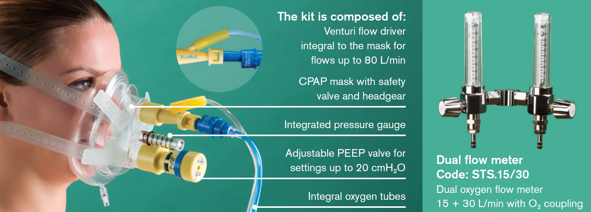
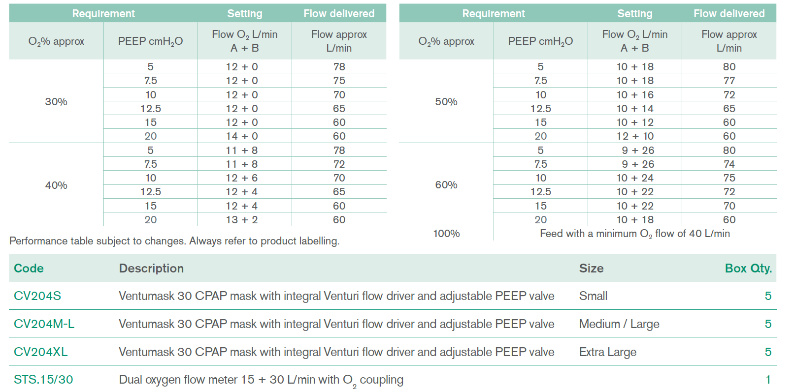

## StarMed Ventumask 30
StarMed Ventumask 30 is a unique design for CPAP therapy
that is simply activated by connecting to an appropriate oxygen supply. It can be used in a hospital environment or pre-hospital use, for example in an ambulance.

## Advantages and Technical Features

-  Ventumask 30 is a complete and easy to use system, where the oxygen supply tubes, a Venturi flow driver and a PEEP valve are integral to a CPAP mask fitted with a pressure gauge
- The built-in adjustable PEEP valve can provide patient pressures in a range of settings up to 20 cmH2O
- The integrated Venturi flow driver can generate patient flows up to 80 L/min while consuming a reduced amount of compressed oxygen
- O2% can be adjusted from 30% to 100% at each PEEP level
- The user is guided by a performance table integral to the product, for independent PEEP and O2% settings

